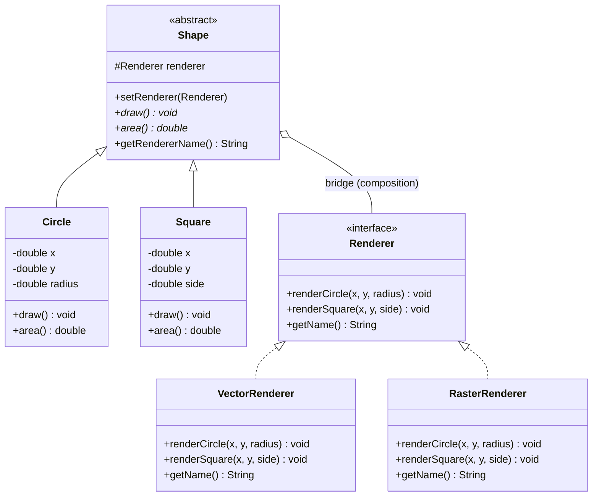

# Bridge Pattern — Shape / Renderer

Assignment #3, ShP-2216 Software Design Patterns, Astana IT University.
Implements the **Bridge** structural design pattern (Option A: Shape–Renderer).

## Why Bridge fits

A `Shape` (Circle, Square, ...) and the way it gets drawn (vector, raster, ...)
are two independent concerns. Without Bridge, adding a new shape *and* a new
rendering technology would multiply classes (`VectorCircle`, `RasterCircle`,
`VectorSquare`, `RasterSquare`, ...). Bridge decouples the two hierarchies by
composition: `Shape` holds a `Renderer` reference instead of inheriting a
rendering implementation, so either side can grow without touching the other.

## Structure

```
src/main/java/kz/astanait/bridge/
├── abstraction/
│   ├── Shape.java          # Abstraction — holds a Renderer reference
│   ├── Circle.java         # Refined Abstraction
│   └── Square.java         # Refined Abstraction
├── implementor/
│   ├── Renderer.java       # Implementor interface
│   ├── VectorRenderer.java # Concrete Implementor
│   └── RasterRenderer.java # Concrete Implementor
└── Main.java                # Client — composes and switches at runtime
```

## UML class diagram



## Running

Requires JDK 17+.

```bash
javac -d out $(find src -name "*.java")
java -cp out kz.astanait.bridge.Main
```

### Expected output (abridged)

```
--- Initial configuration ---
Using: Vector (SVG-like) renderer
[VECTOR] <circle cx="0.0" cy="0.0" r="5.0" />
Area: 78.54

Using: Raster (bitmap) renderer
[RASTER] Rasterizing square at (10.0, 10.0), side=4.0 -> 16 pixels
Area: 16.00

--- Switching renderers at runtime (no change to Shape code) ---
Using: Raster (bitmap) renderer
[RASTER] Rasterizing circle at (0.0, 0.0), r=5.0 -> ~79 pixels
Area: 78.54

Using: Vector (SVG-like) renderer
[VECTOR] <rect x="10.0" y="10.0" width="4.0" height="4.0" />
Area: 16.00
```

This shows the same `Circle`/`Square` instances rendered with different
`Renderer` implementations at runtime, with zero changes to the abstraction
classes — the core requirement of the pattern.

## Clean Code principles applied

See `CLEAN_CODE.md` for the five principles with before/after excerpts.

## Author

Individual assignment — Astana IT University, ShP-2216.
